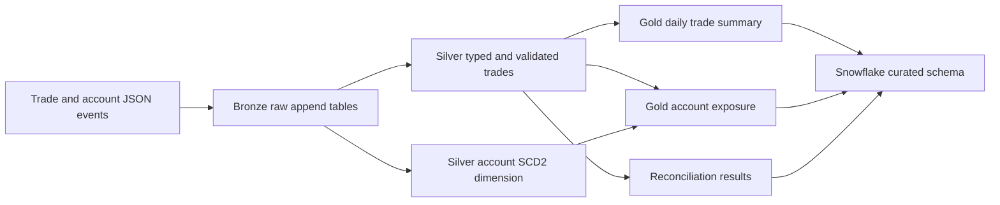

# Architecture Notes

## Medallion Layers

## Design Decisions

- Bronze keeps producer shape and ingestion metadata so raw events are auditable.
- Silver owns typing, compatibility defaults, validation status, and deduplication.
- Account state is modeled with SCD Type 2 rows, not overwritten snapshots.
- Reconciliation results are first-class data products under the audit layer.
- Gold tables are warehouse-shaped and can be copied into Snowflake with Parquet.

## Operational Signals

- Pipeline is deterministic and can be rerun locally.
- Reconciliation checks produce structured pass, fail, and warning statuses.
- Schema evolution is represented in committed sample data, not only described.
- Iceberg examples cover partition evolution, snapshot inspection, and time travel.
